  

# 🍯 Ecosistema Apicola™ — Sistema de Gestión de Colmenas para Apicultores

*Porque cada abeja cuenta... y la reina manda.*

---

## 🐝 Descripción

**Ecosistema Apicola** es una aplicación en Java orientada a objetos diseñada para gestionar colmenas en una explotación apícola. Con un enfoque modular y educativo, este sistema integra múltiples aspectos fundamentales de la programación Java, desde estructuras básicas hasta hilos, recursividad, expresiones lambda y manejo de archivos.

Este proyecto es parte de una entrega grupal individual del salón, porque... sí, así funciona la vida 🐝💻

---

## ⚙️ Características Principales

### 🔧 Gestión de Colmenas
- Agregar, actualizar y visualizar colmenas
- Registro de inspecciones periódicas
- Monitoreo de salud y producción de miel

### 🧑‍🌾 Gestión de Apicultores
- Registro y actualización de datos
- Asociación con colmenas específicas

### 🐝 Modelo de Abeja Reina
- Representación avanzada con atributos de edad, productividad y salud

### 🧪 Inspecciones Detalladas
- Historial con fecha, resultados y acciones tomadas
- Búsqueda recursiva en historial de inspecciones

---

## 🧠 Funcionalidades Técnicas

| Área | Tecnologías Aplicadas |
|------|------------------------|
| **POO** | Clases, herencia, polimorfismo, encapsulamiento |
| **Validación** | Expresiones regulares y manejo de excepciones |
| **Persistencia** | Lectura/escritura en archivos |
| **Paralelismo** | Simulación de inspecciones concurrentes con hilos |
| **Funciones Lambda** | Filtrado y mapeo de datos (producción, salud) |
| **UI** | Interfaz por consola limpia e intuitiva |
| **Recursividad** | Análisis profundo del historial de inspecciones |

---

## 🐝 Estructura de Clases

---

## 🚀 Ejecución

### Compilar
javac PrinColmena.java

### Ejecutar
java PrinColmena

## 📦 Requisitos

    Java 8 o superior

    Compilador de Java (javac)

    Terminal o consola

## 🔍 Ejemplos de Uso

> Listar colmenas
ID: COL001 | Ubicación: Zona Norte | Salud: Buena | Miel: 12.3L

> Registrar inspección
Fecha: 2025-04-25 | Resultado: Sin anomalías | Acción: Ninguna

## 🧯 Validaciones y Seguridad

    Nombres de apicultores: solo letras y espacios (^[A-ZÁÉÍÓÚÑa-záéíóúñ ]+$)

    ID de colmenas: formato COL###

    Cantidad de abejas: solo números positivos

    Fecha de inspección: formato dd/MM/yyyy

## ✨ Bonus: Funcionalidades Cool

    ✅ Simulación de múltiples inspecciones en paralelo usando Thread

    ✅ Búsqueda recursiva en inspecciones: "¿cuándo fue la última vez que esta colmena tuvo problemas?"

    ✅ Uso de lambda para filtrar colmenas por salud o productividad

## 🧾 Licencia

Este proyecto fue creado con fines académicos. Reutilízalo con crédito si te ayudó en algo 🐝

🐝 Frase del Día

    “La vida de la colmena depende del zumbido del código.” — H_4sh
